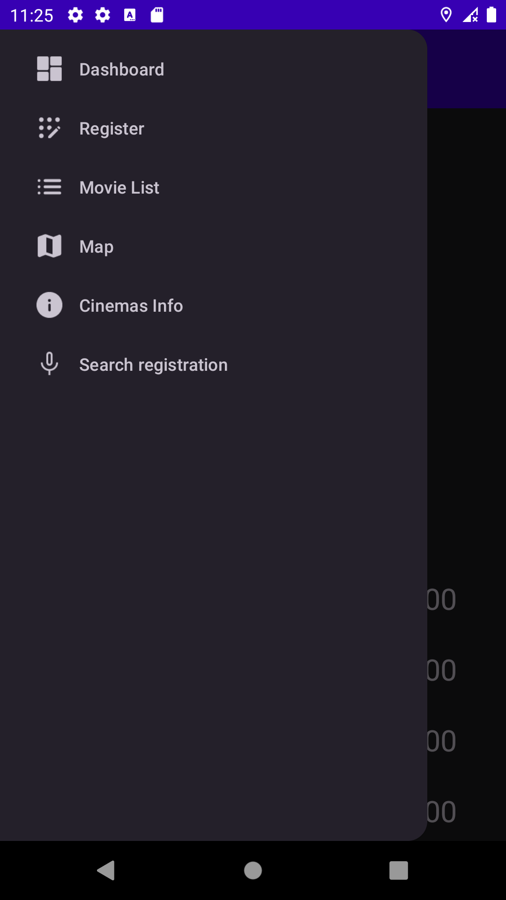

**André Cruz**  
(Abrir ficheiro readme sozinho para melhor visibilidade)

**(Este trabalho foi um projeto de faculdade, onde exigiu o cumprimento de requesitos obrigatorios e suas restrições(este ultimo, por exemplo, sem implementar qualquer tipo de "LiveData" ou "RxJava"))**

**(Existiu um maior desenvolvimento após avaliação deste trabalho, o qual poderá ter documentação desatualizada, contudo todo o codigo neste github está atualizado e na mais recente versão)**

**(Neste repositorio não inclui persistencia de dados na rotação do ecra(lista) com o uso do "Parcelable"(implementado na class "RegistrationData"), no entanto no meu repositorio privado essa "funcionalidade" encontra-se implementada)**

## Secreenshots App

  
  
  

  
  
  

 
  
  
  

  
  
  

  
  
  

  
  
  

  
  

 

## Screenshots Multi Idioma

### Espanhol (**layout/versão antiga**)

  
  
  

### Português (**layout/versão antiga**)

  
  
  

## Dados introduzidos hardcoded na aplicação
No DashBoard a imagem de apresentação com o imagem do filme "Black Panther", com titulo do mesmo e "Amazing Movie"(este ultimo muda consoante o idioma).

## Funcionalidades Implementadas

- Dashboard 
- Apresentação dos filmes - Lista 
- Apresentação dos filmes - Lista - Rotação 
- Detalhe do filme (sem fotografias) 
- Registo de filmes (sem fotografias) 
- Suporte multi-idioma 
- Navegabilidade  

- Registo de Filmes (Pré seleciona o cinema(spinner) consoante geolocalização) 
- Inserir corretamente na base de dados  
- Validação e obtenção dos dados do filme via API 
- Validação e obtenção dos dados do cinema via JSON 
- Utilização de geo-localização (além da utilização no ecrã lista e mapa, pré seleciona o cinema(spinner) mais próximo no momento/ecrã do registo)  
- Inserir fotografias na base de dados
- Apresentação dos filmes - Lista 
- Apresentação dos filmes - Mapa 
- Detalhe do filme (sem fotografias) 
- Detalhe do filme (apenas a parte das fotografias)
- Pesquisa de filmes por voz - Funcionalidade Avançada
- Funcionamento Offline - Funcionalidade Avançada 
- Video (versão antiga, demonstrativo apenas) 
- Ficheiro chatgpt.txt  

- Regista Já (virar devagar o telemovel no simulador, se virar com os botoes do simulador, deteta shaking devido à rapidez do mesmo e vai para o ecra de registo) 
- Filtros - Apresentação em Lista 
- Ordenação - Apresentação em Lista 

**No Dashboard foram adicionados pequenos algoritmos que calcula:** 
-cinema mais frequentado 
-Numero total de registos 
-Media de rates 

[Video](https://www.youtube.com/watch?v=ahoMPmi38v0) -> **VERSÃO ANTIGA DO PROJETO, APENAS DEMONSTRATIVO**

## Descrição nome classes, métodos e atributos

- Cinemas: (Usado para obter todas as informações de cada cinema providenciado do json, tais como: id, nome, provedor de cinema, logo, latitude e longitude, morada, codigo postal, cidade, fotos, ratings e Horas de funcionamento)

data class Cinema( 
val cinema_id: Int, 
val cinema_name: String, 
val cinema_provider: String, 
val logo_url: String?, 
val latitude: Double, 
val longitude: Double, 
val address: String, 
val postcode: String, 
val county: String, 
val photos: List<String>?, 
val ratings: List<CinemaRating>, 
val opening_hours: CinemaDays 
) 

data class CinemaRating( 
val category: String, 
val score: Int 
) 

data class CinemaDays( 
val Monday: CinemaOpeningHours, 
val Tuesday: CinemaOpeningHours, 
val Wednesday: CinemaOpeningHours, 
val Thursday: CinemaOpeningHours, 
val Friday: CinemaOpeningHours, 
val Saturday: CinemaOpeningHours, 
val Sunday: CinemaOpeningHours 
) 

data class CinemaOpeningHours( 
val open: Timestamp, 
val close: Timestamp 
) 

- Filmes: (Usado para obter as informações vindas da API de um filme escolhido que o utilizador irá registar ou visualizar detalhes, tais como: id, nome do filme, url cartaz, genero, sinopse, lancamento, avaliacao e link)

data class Filmes ( 
val id: String, 
val filme: String, // nome 
val cartaz: String, 
val genero: String, 
val sinopse: String, 
val lancamento: String, 
val avaliacao: String, 
val languages: String, 
val awards: String, 
val actors: String, 
val director: String, 
val imdbVotes: String 
) 

- FilmesModel: (Usado para obter os filmes em pré seleção para o registo à posteriori, inseridos na recycler view de pesquisa por nome, onde guarda, os titulos encontrados por aquele nome e imdb id de cada um)

data class FilmesModel (
val Title: String,
val imdbID: String
) 

- Registrationdata: (Usado para registar o filme na obtenção do id e nome do filme vindo da api, como tambem recolher as informações do utilizador como o cinema(id e nome) onde visualizou, rate, data quando visualizou e observacoes)

data class RegistrationData( 
val id: Int, 
val filmeId: String, 
val cinemaId: Int, 
val name: String, 
val cinema: String, 
val rate: String, 
val date: String, 
val imageUri: String? = null, 
val observacoes: String 
val postcode: String 
) 

- Photo: (Usado para guardar as fotografias inseridas no momento do registo na db e na apresentação detalhes do registo)

data class Photo( 
val dataPhoto: String, 
val Timestamp: Long 
) 

A classe ProjectData é usada para implementar os metodos necessarios no ProjectRoom, ProjectRepository e ProjectOkHttp. 

Project Data    
abstract class ProjectData {

    //Cinemas
    abstract fun getAllCinemas(onFinished: (Result<List<Cinema>>) -> Unit)

    abstract fun insertCinema (cinemas: List<Cinema>, onFinished: () -> Unit)

    abstract fun getCinemaObjectByName(name: String, onFinished: (Result<Cinema>) -> Unit)

    abstract fun getCinemaObjectById(Id: Int, onFinished: (Result<Cinema>) -> Unit)

    //Registo
    abstract fun insertRegistrationData (registrationData: RegistrationData, onFinished: () -> Unit)

    abstract fun getAllRegistrationData(onFinished: (Result<List<RegistrationData>>) -> Unit)

    abstract fun getRegistrationById(filmeId: String, onFinished: (Result<RegistrationData>) -> Unit)

    //Filmes
    abstract fun insertFilmes (filmes: Filmes, onFinished: () -> Unit)

    abstract fun getFilmeById (id:String, onFinished: (Result<Filmes>) -> Unit)

    abstract fun getFilmesByName(searchName: String, onFinished: (Result<List<FilmesModel>>) -> Unit)

    //Filmes to pick
    abstract fun insertFilmesAntesRegisto(filmes: List<FilmesModel>, onFinished: () -> Unit)

} 

## Métodos usados neste ProjectData(que estão presentes ProjectOkHttp, ProjectRepository e ProjectRoom)

getAllCinemas -> obter todos os cinemas 
getCinemaObjectByName -> obter objeto cinema em especifico pelo nome 
getCinemaObjectById -> obter objeto cinema em especifico pelo id 
insertCinema -> inserir cinemas na base de dados vindo do json 

insertRegistrationData -> inserir registo do utilizador na base de dados 
getAllRegistrationData -> obter todos os registos como objectos 
getRegistrationById -> obter o registo pelo uuid na bd 

insertFilmes -> inserir detalhes de filmes vindos da api na base de dados 
getFilmeById -> obter detalhes do filme por id (id vindo da api) 
getFilmesByName -> obter detalhes dos filmes pesquisados pelo nome (detalhes escolhidos vindos da api)  

insertFilmesAntesRegisto -> inserir filmes encontrados à priori na base de dados encontrados pelo o nome na api, para o utilizador depois escolher o filme pretendido a registar 

## Fontes Usadas

ChatGPT Traduções(xml traduzido): 

ChatGPT -> Tradução em Espanhol (Apenas foi usado traduções chatgpt para espanhol) (DESATUALIZADO)

- Foi usado algumas fontes de informação tais como StackOverflow, ChatGPT e geeksforgeeks 
- Foram concedidos alguns repositorios github pelos professores da cadeira com exemplos na ajuda ao desenvolvimento deste projeto aos quais não irei citar, devido ao repositorio estar publico 

Fontes usadas para icones bottom navigation: 
https://fonts.google.com/

"Usado" para saber como fazer abertura e leitura do ficheiro json:  
https://stackoverflow.com/questions/56962608/how-to-read-json-file-from-assests-in-android-using-kotlin

Usado saber como converter timestamp para long, em relação à db(visto que a db só aceita tipos de dados básicos, como um Long):  
https://stackoverflow.com/questions/73133398/how-to-get-sorted-data-from-room-db-on-the-base-of-date-timestamp

Usado para entender como fazer parse do ficheiro json(cinemas.json) e do que vem dos pedidos Api com o uso de jsonArray e jsonObject:  
https://www.tutorialspoint.com/how-to-parse-json-objects-on-android-using-kotlin

-> Inicialmente era utilizado glide, mas foi mudado para o Picasso por crashar a app (apresentação de imagens com link) https://github.com/square/picasso 
-> implementação dos markers (Mapa) 

## Notas
->Por vezes os logs na consola de distancia estão a reportar de modo confuso a distancia, mas é a correta e funcina como devido.
Foi testado inumeras vezes, >500 metros, entre 500 e 1000 metros, como tambem >1000(que já nao aparece nenhum resultado), mesmo com auxilio do google maps e a ferramenta de medições de distancia, afetou sempre a lista corretamente com os filmes do cinema entre as distancia pretendida, tendo em conta a localização atual

-> Por vezes necessário coldBoot caso não funcione o gps (Fused Location)

-> Foi detetado que mesmo após a cedencia de permissioes de geolocalização pela primeira vez, para que fusedLocation e respetivos listeners sejam registados em cada ecra funcionem, é necessario reiniciar a app (é visivel no android status bar)

-> No "Filtrar" da lista, na combinação com nome ou não, só é aplicado uma vez a proximidade(poderá fazer um filtro novamente caso queira), primeiro é feito um filtro por nome e depois por localização. Essa "atualização" quando é escolhida a opção localização, fica dependente pelo TIME_BETWEEN_UPDATES do próprio fusedlocation

-> Foi detetado que as longitudes de latitudes de alguns cinemas, segundo o ficheiro cinemas.json, não são as reais (ficheiro concedido pelo professor da cadeira)

-> No funcionamento offline, quando é apresentado o ecrã para selecionar filmes(pickMovieFragment), apenas aparecem os filmes que já foram retiradas todas as informações da API, i.e. os filmes que já foram registados

-> Foi garantido que o ecrã só roda apenas no ListFragment e FilterFragment(visto que está associado à operação do ecra lista e "necessita" de ficar horizontal para ser coerente com a rotação em que estava à priori(lista))
